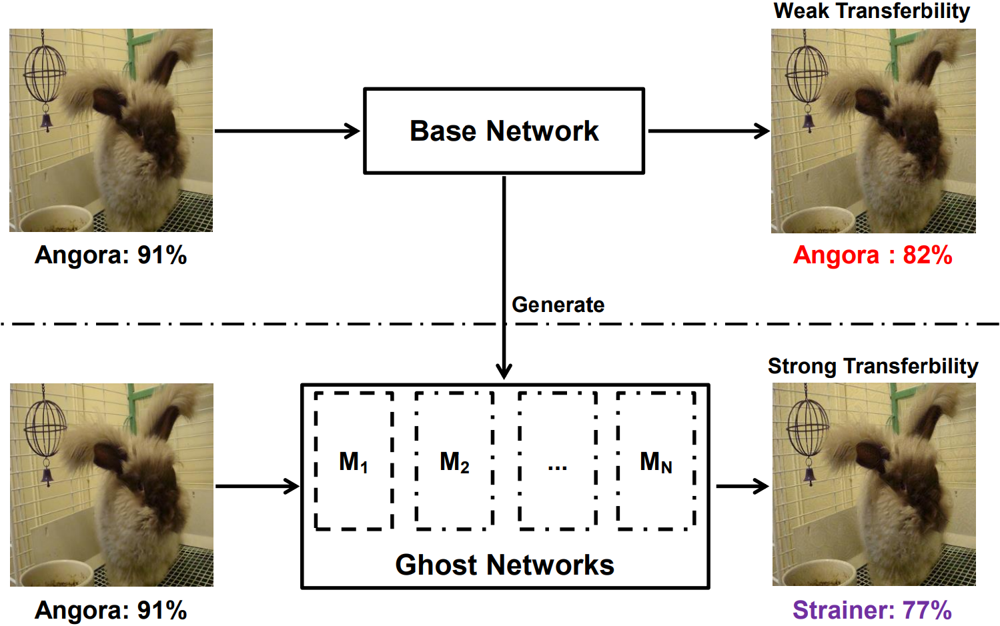

# Learning Transferable Adversarial Examples via Ghost Networks

## Introduction
This repository contains the code for paper [Learning Transferable Adversarial Examples via Ghost Networks](https://arxiv.org/abs/1812.03413). 
In this paper, we propose Ghost Networks to efficiently learn transferable adversarial examples. 
The key principle of ghost networks is to perturb an existing model, which potentially generates a huge set of diverse models.
Those models are subsequently fused by longitudinal ensemble. Both steps almost require no extra time and space consumption.
Experiment shows this method could consistently gain additional transferability for iteration-based method (such as I-FGSM and MI-FGSM).


## Extension
To improve the transferability further, we
- attack multiple networks simultaneously (https://arxiv.org/abs/1611.02770).

## Usage

### Dependencies
+ [Anaconda](https://www.anaconda.com/distribution/) 
+ Python3.6
+ Tensorflow 1.10.0
+ Tensorpack 0.9.0.1
+ easydict
+ scipy
+ pillow

Here is a sample scrip to install Dependencies after you have Anaconda.
```bash
conda create -n python3 python=3.6
source activate python3
pip install --upgrade tensorflow-gpu
pip install --upgrade git+https://github.com/tensorpack/tensorpack.git
pip install easydict
conda install -c anaconda scipy
pip install pillow
```

### Dataset and model checkpoints
We use images from ImageNet LSVRC 2012 Validation Set and resized them to 299x299.
You can download the preprocessed images **[HERE](https://livejohnshopkins-my.sharepoint.com/:u:/g/personal/yli286_jh_edu/Ecdhl1ZmYLVDmjsEBCTxAEsBYQndaXNu4StPmrAuin2IrQ?e=wRVSUd)**
if you accept the [terms](http://academictorrents.com/details/5d6d0df7ed81efd49ca99ea4737e0ae5e3a5f2e5).

We use 6 clean trained models (Inception-{v3, v4}, Resnet-v2-{50, 101, 152}, Inception-Resnet-v2) 
and 3 ensemble adversarial trained models (ens3_inception_v3, ens4_inception_v3, ens_inception_resnet_v2).
We original download them from [here](https://github.com/tensorflow/models/tree/master/research/slim) and [here](https://github.com/tensorflow/models/tree/master/research/adv_imagenet_models)
and then slightly modified the tensor name. You can download the modified checkpoints from **[HERE](https://livejohnshopkins-my.sharepoint.com/:u:/g/personal/yli286_jh_edu/ETyQNqHlah9KmCqOvUDjQsYBzoU4dKRZ5QuPjc4PKdyiJA?e=yaePGL)**.

After download them, edit and use ```data/link_to_data.sh``` to build soft link ```data/checkpoints``` and ```data/val_data``` by
```bash
bash data/link_to_data.sh
```

We assign every network with an id, so that they can be shortly mentioned in one character. Here is a table to provide ids for each network.
You can see line 58 to 62 of config.py for more details.

ID | 0 | 1 | 2 | 3 | 4 | 5 | 6 | 7 | 8 
---|---|---|---|---|---|---|---|---|---
Network Name|IncV3|IncV4|Res50|Res101|Res152|IncRes|Ens3IncV3|Ens3IncV4|EnsIncRes 

### Attack and Eval Examples
This section provide some examples, you can check config.py for more options.
#### Basic FGSM, I-FGSM, and MI-FGSM
FGSM attack ```inception_v3```(ID=0) and evaluate success rate
```bash
bash pipeline.sh --exp FGSM --attack_network 0 --num_steps 1 --max_epsilon 8.0 --step_size 8.0 --GPU_ID 0
```

I-FGSM attack ```inception_v3```(ID=0) and evaluate success rate
```bash
bash pipeline.sh --exp I-FGSM --attack_network 0 --GPU_ID 0
```

MI-FGSM attack ```inception_v3```(ID=0) and evaluate success rate
```bash
bash pipeline.sh --exp MI-FGSM --attack_network 0 --momentum 1.0 --GPU_ID 0
```

#### Our proposed method
MI-FGSM attack ```inception_v3```(ID=0) with dropout erosion (with the optimal keep_prob) and evaluate success rate
```bash
# these two line of scripts are same, since the optimal keep_prob for inception_v3 is 0.994
bash pipeline.sh --exp MI-FGSM-0.994 --attack_network 0 --momentum 1.0 --keep_prob 0.994 --GPU_ID 0
bash pipeline.sh --exp MI-FGSM-optimal --attack_network 0 --momentum 1.0 --optimal --GPU_ID 0
```

MI-FGSM attack ```resnet_v2_50```(ID=2) with residual erosion (with the optimal Lambda) and evaluate success rate
```bash
# these two line of scripts are same, since the optimal Lambda for resnet_v2_50 is 0.22
bash pipeline.sh --exp MI-FGSM --attack_network 2 --momentum 1.0 --random_range 0.22 --GPU_ID 0
bash pipeline.sh --exp MI-FGSM --attack_network 2 --momentum 1.0 --optimal --GPU_ID 0
```

#### Attack multiple networks (Ensemble attack, [Liu et al](https://arxiv.org/abs/1611.02770))
Simply put all network ids to the parameter of ```--attack_network```, if your GPU memory is not enough, reduce the ```--batch_size```.

For example, attack the ensemble of ```inception_v3``` and ```inception_v4``` with ```batch_size=2```
```bash
bash pipeline.sh --exp FGSM --attack_network 01 --num_steps 1 --max_epsilon 8.0 --step_size 8.0 --batch_size 2 --GPU_ID 0
```

### Trouble Shooting
```bash
Traceback (most recent call last):
  File "attack.py", line 5, in <module>
    from config import config as FLAGS
  File "/home/yingwei/lyw/mount_point/ghost-network/config.py", line 81, in <module>
    assert config.overwrite or config.skip, "{:s}".format(config.result_dir)
AssertionError: result/I-FGSM...
```
This Assertion Raise due to ```config.result_dir``` already exists, mainly due to you run the same scripts twice. You can either 
1) remove that director
2) add option ``--overwrite`` to ignore this issue 

If you find the code useful, please consider citing the following paper.

    @article{li2018learning,
      title={Learning Transferable Adversarial Examples via Ghost Networks},
      author={Li, Yingwei and Bai, Song and Zhou, Yuyin and Xie, Cihang and Zhang, Zhishuai and Yuille, Alan},
      journal={arXiv preprint arXiv:1812.03413},
      year={2018}
    }

If you encounter any problems or have any inquiries, please contact us at yingwei.li@jhu.edu.

